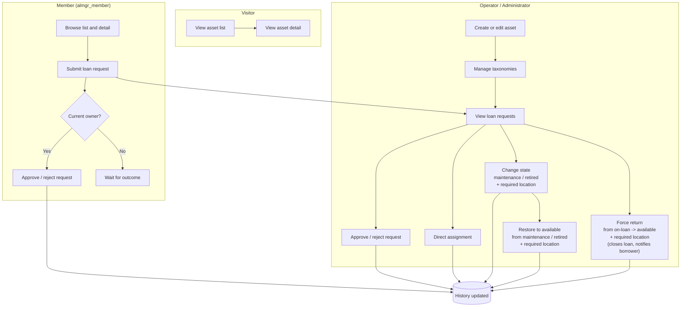

# Role Actions Swimlane - Asset Lending Manager

Mermaid diagram version of `DOC/RolePermissionsMatrix.md`.
If your viewer does not render Mermaid, use the ASCII version below.

---

## Mermaid diagram



---

## ASCII version

```text
VISITOR
  [View asset list] -> [View asset detail]

MEMBER (almgr_member)
  [Browse list and detail]
    -> [Submit loan request]
    -> <Current owner?>
         |-- Yes --> [Approve or reject request]
         `-- No --> [Wait for outcome]

OPERATOR / ADMINISTRATOR
  [Create or edit asset]
    -> [Manage taxonomies]
    -> [View loan requests]
    -> [Approve or reject request]
    -> [Direct assignment]
    -> [Change state: maintenance / retired] + required location
         `-> [Restore to available from maintenance/retired] + required location
    -> [Force return: on-loan -> available] + required location
         (closes active loan, notifies borrower)

CROSS-LANE LINKS
  Member: [Submit loan request] ---------> Operator: [View loan requests]
  Member/Owner: [Approve/reject]   \
  Operator: [Direct assignment]     +---> [History updated]
  Operator: [Change/Restore state] /
  Operator: [Force return]         /
```

---

*Last update: 2026-04-14 (rev 1)*
