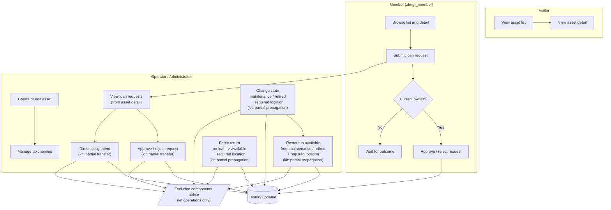

# Role Actions Swimlane - Asset Lending Manager

Mermaid diagram version of `DOC/RolePermissionsMatrix.md`.
If your viewer does not render Mermaid, use the ASCII version below.

---

## Mermaid diagram


```mermaid
flowchart TD
  subgraph VIS["Visitor"]
    V1["View asset list"]
    V2["View asset detail"]
    V1 --> V2
  end

  subgraph MEM["Member (almgr_member)"]
    M1["Browse list and detail"]
    M2["Submit loan request"]
    M3{"Current owner?"}
    M4["Approve / reject request"]
    M5["Wait for outcome"]
    M1 --> M2 --> M3
    M3 -->|Yes| M4
    M3 -->|No| M5
  end

  subgraph OPE["Operator / Administrator"]
    O1["Create or edit asset"]
    O2["Manage taxonomies"]
    O3["View loan requests\n(from asset detail)"]
    O4["Approve / reject request\n(kit: partial transfer)"]
    O5["Direct assignment\n(kit: partial transfer)"]
    O6["Change state\nmaintenance / retired\n+ required location\n(kit: partial propagation)"]
    O7["Restore to available\nfrom maintenance / retired\n+ required location\n(kit: partial propagation)"]
    O8["Force return\non-loan -> available\n+ required location\n(kit: partial propagation)"]
    O1 --> O2
    O3 --> O4
    O3 --> O5
    O6 --> O7
  end

  EX[/"Excluded components notice\n(kit operations only)"/]
  H1[("History updated")]

  M2 --> O3
  M4 --> H1
  O4 --> H1
  O4 --> EX
  O5 --> H1
  O5 --> EX
  O6 --> H1
  O6 --> EX
  O7 --> H1
  O7 --> EX
  O8 --> H1
  O8 --> EX
```

---

## ASCII version

```text
VISITOR
  [View asset list] -> [View asset detail]

MEMBER (almgr_member)
  [Browse list and detail]
    -> [Submit loan request]
    -> <Current owner?>
         |-- Yes --> [Approve or reject request]
         `-- No --> [Wait for outcome]

OPERATOR / ADMINISTRATOR
  [Create or edit asset]
    -> [Manage taxonomies]

  [View loan requests] (from asset detail page)
    -> [Approve or reject request]  (kit: partial transfer -> excluded notice)
    -> [Direct assignment]          (kit: partial transfer -> excluded notice)

  [Asset detail page]
    -> [Change state: maintenance / retired] + required location
         (kit: partial propagation -> excluded notice)
         `-> [Restore to available] + required location
               (kit: partial propagation -> excluded notice)
    -> [Force return: on-loan -> available] + required location
         (kit: partial propagation -> excluded notice)
         (closes active loan, notifies borrower)

CROSS-LANE LINKS
  Member: [Submit loan request] ---------> Operator: [View loan requests]
  Member/Owner: [Approve/reject]   \
  Operator: [Direct assignment]     +---> [History updated]
  Operator: [Change/Restore state] /
  Operator: [Force return]         /
```

---

**Note — partial kit propagation:** kit transfers and kit state changes apply only to eligible components. Components in `maintenance`/`retired` or assigned to another user are excluded. The operator receives a warning notice listing skipped components after each operation. See `DOC/KitBehaviorReference.md` for full details.

---

## See also

- `DOC/RolePermissionsMatrix.md` — tabular permissions reference with ASCII swimlane.
- `DOC/KitBehaviorReference.md` — full inclusion/exclusion rules for kit operations.

---

*Last update: 2026-08-29 (rev 4)*
