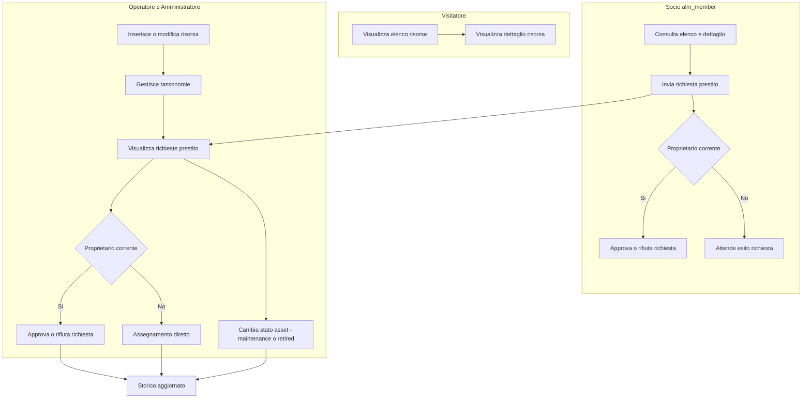

# Swimlane schema permessi per ruolo — Asset Lending Manager

Questo file contiene la versione grafica Mermaid dello swimlane del documento `DOC/SchemaPermessiPerRuolo.md`.

Se il tuo viewer Markdown non renderizza Mermaid, usa la versione testuale ASCII in `DOC/SchemaPermessiPerRuolo.md`.
