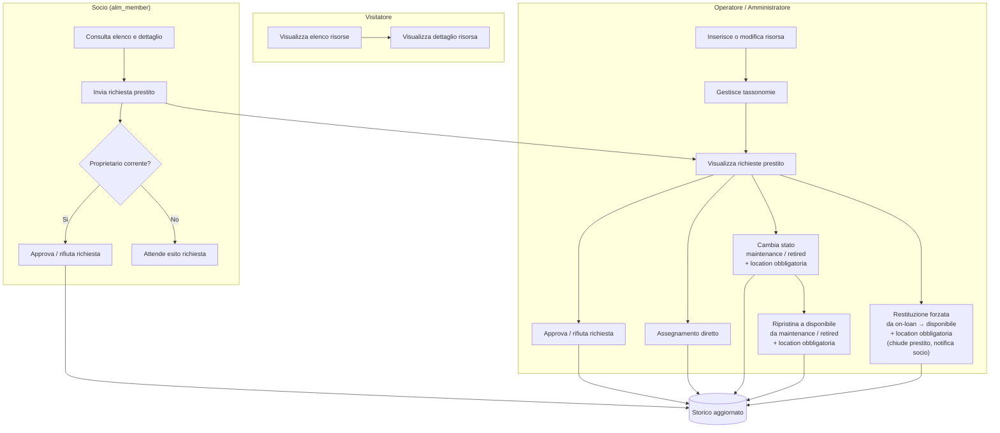

# Swimlane azioni per ruolo — Asset Lending Manager

Versione grafica Mermaid del documento `DOC/SchemaPermessiPerRuolo.md`.
Se il tuo viewer non renderizza Mermaid, usa la versione testuale ASCII in fondo al file.

---

## Diagramma Mermaid



---

## Versione ASCII

```text
VISITATORE
  [Visualizza elenco risorse] -> [Visualizza dettaglio risorsa]

SOCIO (alm_member)
  [Consulta elenco e dettaglio]
    -> [Invia richiesta prestito]
    -> <Proprietario corrente?>
         |-- Si --> [Approva o rifiuta richiesta]
         `-- No --> [Attende esito richiesta]

OPERATORE / AMMINISTRATORE
  [Inserisce o modifica risorsa]
    -> [Gestisce tassonomie]
    -> [Visualizza richieste prestito]
    -> [Approva o rifiuta richiesta]
    -> [Assegnamento diretto]
    -> [Cambia stato: maintenance / retired] + location obbligatoria
         `-> [Ripristina a disponibile da maintenance/retired] + location obbligatoria
    -> [Restituzione forzata: on-loan -> disponibile] + location obbligatoria
         (chiude prestito aperto, notifica il socio)

COLLEGAMENTI TRA SWIMLANE
  Socio: [Invia richiesta prestito] ---------> Operatore: [Visualizza richieste prestito]
  Socio/Operatore: [Approva/rifiuta] \
  Operatore: [Assegnamento diretto]   +---> [Storico aggiornato]
  Operatore: [Cambia/Ripristina]     /
  Operatore: [Restituzione forzata] /
```

---

*Ultimo aggiornamento: 2026-03-22*
