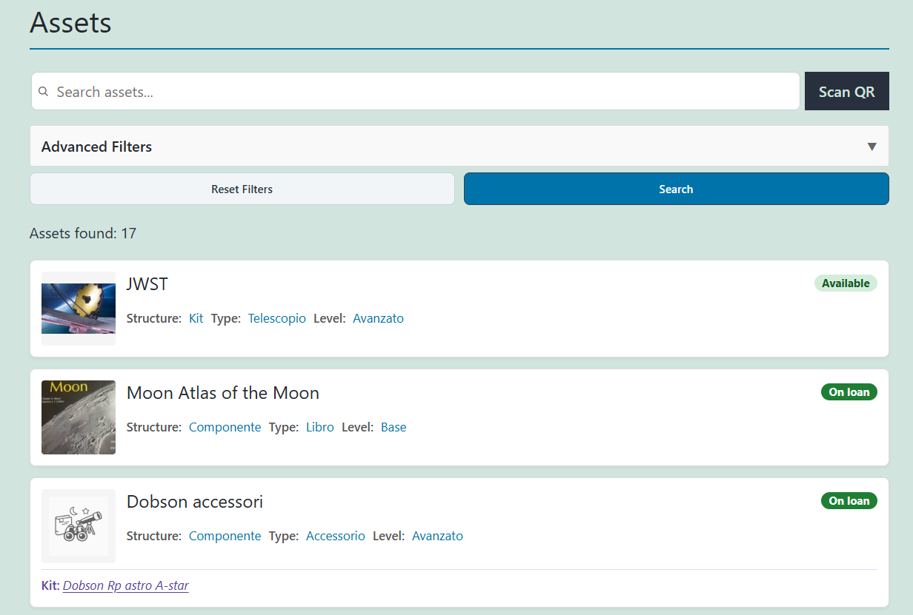
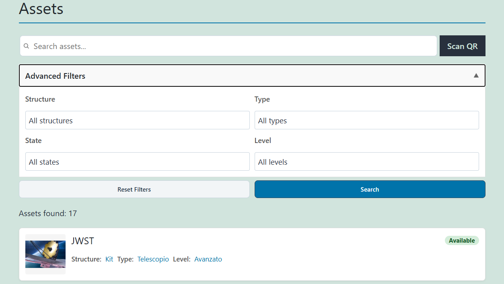
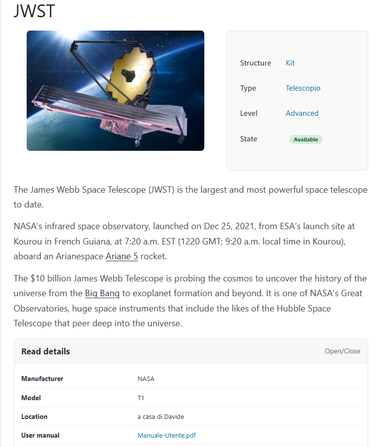
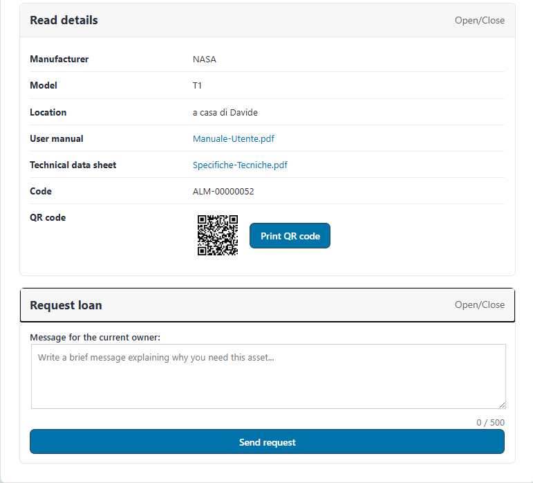
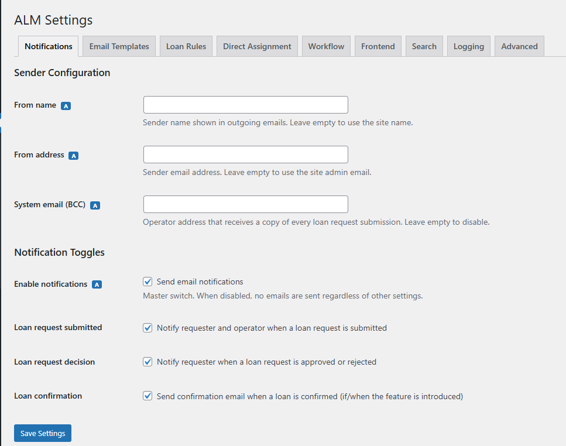

# WordPress Asset Lending Manager

Asset Lending Manager is an open-source WordPress plugin that helps any organization manage shared physical assets and internal lending workflows.

Designed for clubs, associations, schools, public bodies, libraries, laboratories, makerspaces, and any group that loans equipment or materials to its members.

Members can browse available assets and submit loan requests, while operators and administrators can manage assignments and loan history.

The plugin follows WordPress coding standards, uses a modular architecture, and is designed to be simple, extensible, and future-proof. Born within an association of amateur astronomers to manage telescopes and equipment, it is published as a general-purpose tool usable by any organization.

---

## Features

- Asset and kit management
- Frontend asset browsing with filters (type, state, structure, search)
- QR code generation and print label from asset detail page
- QR scanner from asset list (camera-based quick lookup)
- Loan request workflow (submit, approve, reject)
- Direct assignment by operator/admin (reason is mandatory; max length is configurable)
- Automatic cancellation of concurrent pending requests after assignment (configurable)
- Asset state management from frontend: operators can set maintenance, retired, or force-return on-loan assets to available; location field required on every state change
- Email notifications for all loan workflow events (request, approval, rejection, cancellation, direct assignment, forced return), when notifications are enabled
- Loan history tracking
- Role-based permissions (`almgr_member`, `almgr_operator`)
- Read-only JSON REST API (`/wp-json/almgr/v1/`) for asset list, asset detail, member list, and member assets; authentication via WordPress core (cookie session, REST nonce, Application Passwords)
- Back-office Tools page (`ALM → Tools`) with Import, Export, and Utilities tabs
- Users CSV import from the Tools page (admin only) and users CSV export (admin and operator)
- Assets CSV import from the Tools page (admin and operator) and assets CSV export (admin and operator)
- Kit import and export: kit components and their ACF fields are included in the asset CSV
- Translation-ready

---

## Screenshots

1. Asset list in the frontend view (`assets/screenshots/frontend_assets_list.png`)
   

2. Advanced search in the frontend view (`assets/screenshots/advanced_search_fontend.png`)
   

3. Asset detail page in the frontend view (`assets/screenshots/fronted_asset_detail.png`)
   

4. Loan request form in the backoffice view (`assets/screenshots/backoffice_loan_form.png`)
   

5. Settings in the backoffice view (`assets/screenshots/backoffice_settings.png`)
   

---

## Requirements

This plugin requires the Advanced Custom Fields plugin (free).
QR features use bundled JavaScript libraries:
- `qrcode-generator` (MIT)
- `jsQR` (Apache-2.0)

---

## Loan Workflow

1. A member browses the available assets.
2. A loan request is submitted for a selected asset.
3. Notification emails are sent to the requester and, when applicable, to the current owner.
4. The current owner can approve or reject the request.
5. On approval, ownership is transferred and asset state is updated to on-loan.
6. Operators/admins can directly assign any asset that is not retired or under maintenance (when direct assignment is enabled).
7. Operators can change asset state (→ maintenance, → retired) from the frontend, providing a location and optional notes.
8. Operators can force-return an on-loan asset to available directly from the frontend; this closes the active loan, clears the owner, and notifies the borrower.
9. Assets in maintenance or retired state can be restored to available by operators.
10. All decisions, assignments, and state changes are recorded in loan history.

For detailed role/action and notification schemas, see:
- `DOC/SchemaPermessiPerRuolo.md`
- `DOC/SchemaAzioniSwimlane.md`
- `DOC/SchemaNotificheEmail.md`

---

## Asset State Machine

| From \ To  | available | on-loan | maintenance | retired |
|------------|-----------|---------|-------------|---------|
| **available** | — | ✅ loan approval / direct assign | ✅ operator | ✅ operator |
| **on-loan** | ✅ operator (forced return) | — | ✅ operator | ✅ operator |
| **maintenance** | ✅ operator (restore) | ❌ | — | ❌ |
| **retired** | ✅ operator (restore) | ❌ | ❌ | — |

All operator state transitions require a **location** field (mandatory) and accept optional notes.
Kit state changes propagate to all components.
Direct assignment can also reassign an already on-loan asset while keeping state `on-loan`.

---

## Installation

1. Ensure **Advanced Custom Fields (ACF)** is installed and active.
2. Upload the `asset-lending-manager` folder to the `/wp-content/plugins/` directory.
3. Activate the plugin through the **Plugins** menu in WordPress.
4. The plugin works out of the box on both classic and block themes, with no shortcodes required for normal use. Asset pages are served automatically via the plugin's built-in templates:
   - `/asset/` — asset catalog with search filters
   - `/asset/asset-name/` — single asset detail page
5. Use the shortcodes only if you need to embed a view inside an existing WordPress page:
   - `[almgr_asset_list]` — embeds the asset catalog into any page or post
   - `[almgr_asset_view]` — embeds the single asset detail view (not needed on standard asset permalinks)
6. Optionally configure email sender settings in wp-admin under **ALM → Settings**.

Settings UI is available in wp-admin under the ALM menu.

## Uninstall

Uninstalling the plugin via the WordPress admin panel removes:

- Plugin settings (`almgr_settings` option)
- Loan request history table (`wp_almgr_loan_requests_history`)
- Pending loan requests table (`wp_almgr_loan_requests`)
- Custom roles (`almgr_member`, `almgr_operator`) and their capabilities

By default, asset posts (`almgr_asset`) and their metadata are preserved.

If you want to remove **all** plugin data (including asset posts and functional asset meta), add this in `wp-config.php` before uninstalling:

```php
define( 'ALMGR_REMOVE_ALL_DATA', true );
```

---

## Development

Install dependencies:
```bash
composer install
```

Run lint:
```bash
composer lint
composer lint:fix
```
