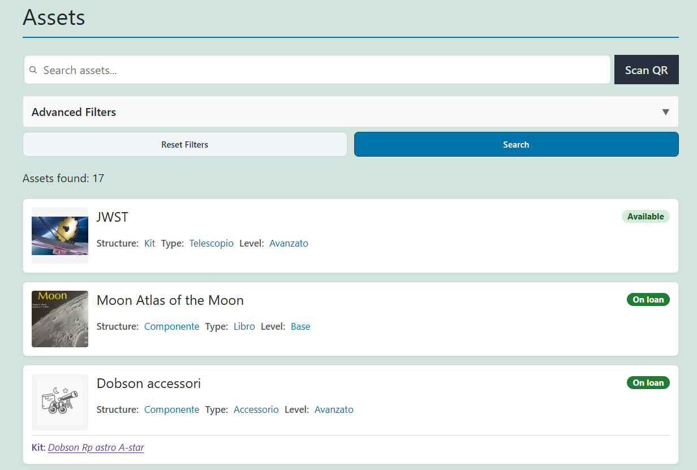
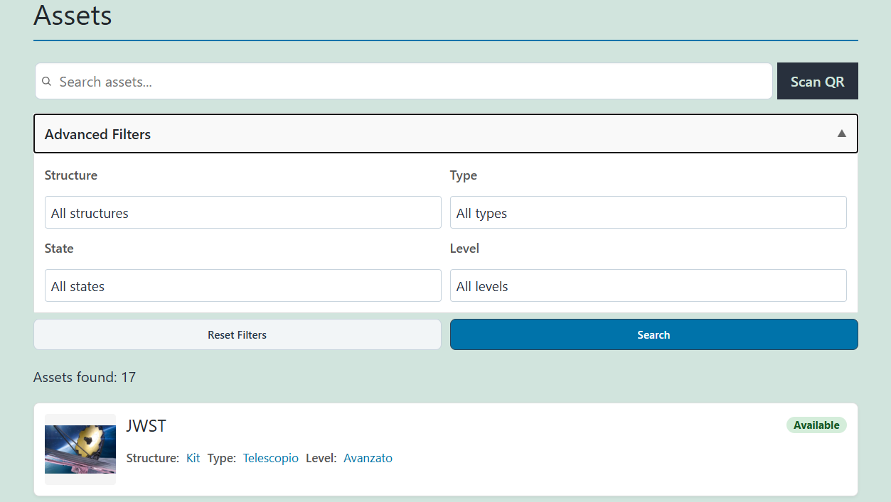
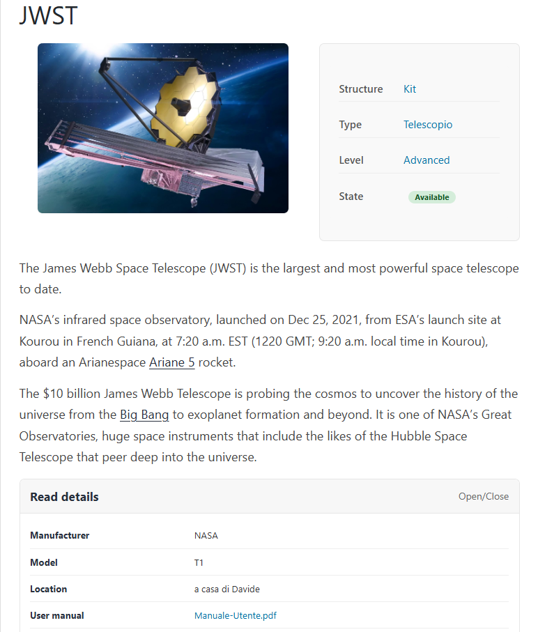
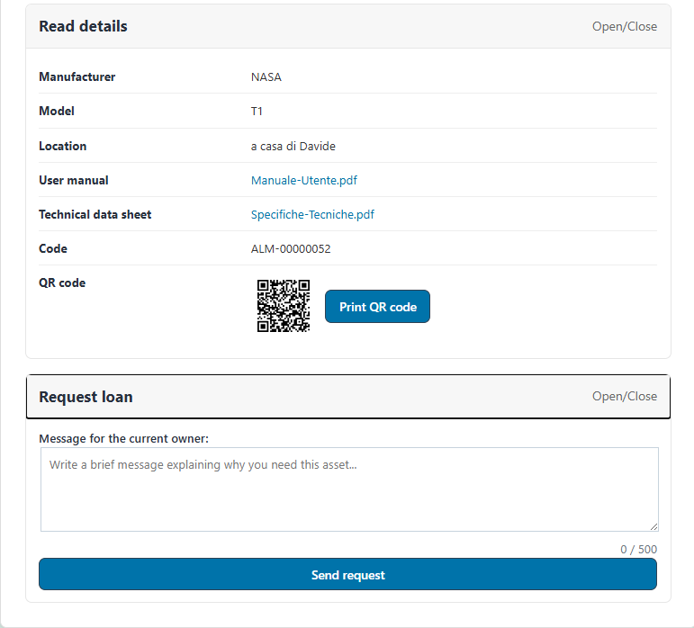
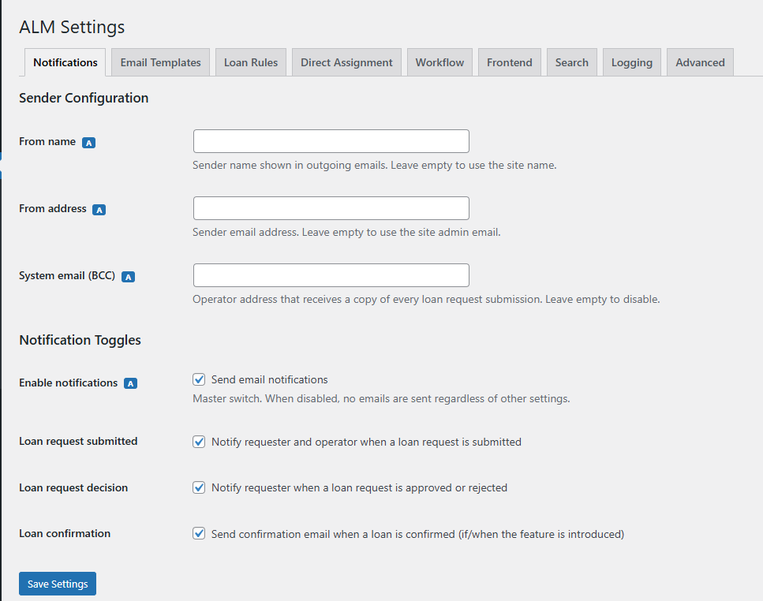

# WordPress Asset Lending Manager

Asset Lending Manager is an open-source WordPress plugin that helps any organization manage shared physical assets and internal lending workflows.

Designed for clubs, associations, schools, public bodies, libraries, laboratories, makerspaces, and any group that loans equipment or materials to its members.

Members can browse available assets and submit loan requests, while operators and administrators can manage assignments and loan history.

The plugin follows WordPress coding standards, uses a modular architecture, and is designed to be simple, extensible, and future-proof. Born within an association of amateur astronomers to manage telescopes and equipment, it is published as a general-purpose tool usable by any organization.

---

## Features

- Asset and kit management
- Frontend asset browsing with filters (type, state, structure, warehouse, search)
- Asset warehouse (`almgr_warehouse`) with member-only visibility and automatic Kit → component propagation
- QR code generation and print label from asset detail page
- QR scanner from asset list (camera-based quick lookup)
- Loan request workflow (submit, approve, reject)
- Direct assignment by operator/admin (reason is mandatory; max length is configurable)
- Automatic cancellation of concurrent pending requests after assignment (configurable)
- Asset state management from frontend: operators can set maintenance, retired, or force-return on-loan assets to available; location is required for operator state changes and is independent from warehouse
- Cooperative asset return from frontend, distinct from operator force-return; optionally available to the current-owner member
- Optional contact form to send email messages to the current asset owner
- Email notifications for all loan workflow events (request, approval, rejection, cancellation, direct assignment, forced return, cooperative return), when enabled
- Loan history tracking
- Full asset history page for operators via `[almgr_asset_history]`
- Role-based permissions (`almgr_member`, `almgr_operator`)
- Read-only REST API for external integrations (asset catalog, member assets, loan requests); see `DOC/REST_API_REFERENCE.md`
- Optional WordPress Abilities for programmatic/AI-agent integrations, available only when running WordPress 6.9 or later (the plugin works normally without it), sharing the same domain logic as the web UI and REST API. MCP itself is not bundled — see `DOC/AI_ABILITIES_REFERENCE.md` for details and how to connect an external MCP adapter such as Claude Desktop
- Back-office Tools page (`ALM → Tools`) with Import, Export, and Utilities tabs
- Users CSV import from the Tools page (admin only) and users CSV export (admin and operator)
- Assets CSV import from the Tools page (admin and operator) and assets CSV export (admin and operator)
- Kit import and export: kit components and their ACF fields are included in the asset CSV
- Translation-ready

---

## Screenshots

1. Asset list in the frontend view (`assets/screenshots/frontend_assets_list.png`)
   

2. Advanced search in the frontend view (`assets/screenshots/advanced_search_fontend.png`)
   

3. Asset detail page in the frontend view (`assets/screenshots/fronted_asset_detail.png`)
   

4. Loan request form in the backoffice view (`assets/screenshots/backoffice_loan_form.png`)
   

5. Settings in the backoffice view (`assets/screenshots/backoffice_settings.png`)
   

---

## Requirements

This plugin requires the Advanced Custom Fields plugin (free).
QR features use bundled JavaScript libraries:
- `qrcode-generator` (MIT)
- `jsQR` (Apache-2.0)

---

## Loan Workflow

1. A member browses an asset and submits a loan request.
2. The current owner, operator, or administrator approves or rejects it.
3. Approval transfers ownership and marks the asset (and eligible kit components) as on-loan.
4. Operators can directly assign assets, change state, force-return assets, and restore them; operator state changes require a location. Cooperative returns leave the location unchanged.
5. Operators can cooperatively return assets; current-owner members can do so when the setting is enabled.
6. Decisions, assignments, returns, and state changes are recorded in loan history.

Cooperative returns notify all operators. The contact form is separate from the loan workflow and is controlled by its own setting.

For detailed documentation, see the `DOC/` folder:
- `DOC/RolePermissionsMatrix.md` — role/operation permission matrix
- `DOC/RoleActionsSwimlane.md` — loan workflow swimlane diagram
- `DOC/EmailNotificationsSchema.md` — email event table with placeholders
- `DOC/KitBehaviorReference.md` — kit transfer and state-change semantics, partial propagation rules
- `DOC/REST_API_REFERENCE.md` — REST API endpoints, authentication, parameters, error codes
- `DOC/AI_ABILITIES_REFERENCE.md` — WordPress Abilities registered by the plugin, permissions, input/output, and how to reach them from an MCP client such as Claude Desktop
- `DOC/AssetsImportCSV_SimpleProcedure.md` — assets CSV import procedure
- `DOC/AssetsExportCSV_SimpleProcedure.md` — assets CSV export procedure
- `DOC/UsersImportCSV_SimpleProcedure.md` — users CSV import procedure
- `DOC/UsersExportCSV_SimpleProcedure.md` — users CSV export procedure

---

## Asset State Machine

| From \ To  | available | on-loan | maintenance | retired |
|------------|-----------|---------|-------------|---------|
| **available** | — | ✅ loan approval / direct assign | ✅ operator | ✅ operator |
| **on-loan** | ✅ operator (forced return) | — | ✅ operator | ✅ operator |
| **maintenance** | ✅ operator (restore) | ❌ | — | ❌ |
| **retired** | ✅ operator (restore) | ❌ | ❌ | — |

Operator state changes require a **location** field (mandatory) and accept optional notes. Cooperative returns display the assigned warehouse, but do not read or modify the independent location field.
Kit state changes propagate only to eligible components; components already in maintenance or retired, or assigned to another user, are excluded and left unchanged. The operator sees a warning notice listing skipped components and the reason for each.
Direct assignment can also reassign an already on-loan asset while keeping state `on-loan`.

---

## Installation

1. Ensure **Advanced Custom Fields (ACF)** is installed and active.
2. Upload the `asset-lending-manager` folder to the `/wp-content/plugins/` directory.
3. Activate the plugin through the **Plugins** menu in WordPress.

**Classic themes:**
4. Asset pages are served automatically — no shortcodes required:
   - `/asset/` — asset catalog with search filters
   - `/asset/asset-name/` — single asset detail page
5. If `/asset/` returns 404, go to **Settings → Permalinks** and click **Save Changes** once.
6. The full asset history page is not automatic. Create a normal WordPress page with the `[almgr_asset_history]` shortcode and assign it in **ALM → Settings → Frontend** as **Asset history page**.

**Block themes:**
4. Block themes do not support automatic PHP template overrides. Create three pages manually:
   - Add `[almgr_asset_list]` to a page — this is your asset catalog.
   - Add `[almgr_asset_view]` to a second page — this is your asset detail view.
   - Add `[almgr_asset_history]` to a third page — this is your full asset history page for operators.
5. In **ALM → Settings → Frontend**, set "Asset archive page", "Asset detail page", and "Asset history page" to the pages you just created. This ensures all asset and history links point to the correct pages.

6. Optionally configure email sender settings in wp-admin under **ALM → Settings**.

Settings UI is available in wp-admin under the ALM menu.

## Shortcodes

- `[almgr_asset_list]` — embeds the full asset catalog with search filters into any page or post.
- `[almgr_asset_view]` — embeds the detail view for a single asset.
- `[almgr_asset_history]` — embeds the full loan history page for a selected asset. This page is operator-only and should be assigned in **ALM → Settings → Frontend** as **Asset history page**.

## Known limitations

- `GET /members/{member_id}/assets` is currently unbounded; use `GET /me/assets` when pagination is required.
- WordPress Abilities currently cover read operations and loan-request creation; operator mutations are not exposed as Abilities.
- MCP support requires the separately installed `wordpress/mcp-adapter` project.

## Uninstall

Uninstalling the plugin via the WordPress admin panel removes:

- Plugin settings (`almgr_settings` option)
- Loan request history table (`wp_almgr_loan_requests_history`)
- Pending loan requests table (`wp_almgr_loan_requests`)
- Custom roles (`almgr_member`, `almgr_operator`) and their capabilities

By default, asset posts (`almgr_asset`) and their metadata are preserved.

If you want to remove **all** plugin data (including asset posts and functional asset meta), add this in `wp-config.php` before uninstalling:

```php
define( 'ALMGR_REMOVE_ALL_DATA', true );
```

---

## Development

Install dependencies:
```bash
composer install
```

Run lint:
```bash
composer lint
composer lint:fix
```

### Tests

All test commands require **PHP 8.x** in the system PATH and `composer install` already run (see above).

**Unit tests** run without a WordPress installation or database — no additional setup needed:
```bash
composer test:unit
```

Unit tests run automatically as a pre-commit hook: a failing suite blocks the commit.
For setup details and a description of what is covered, see [`tests/unit/README.md`](tests/unit/README.md).

**Integration tests** run against a real WordPress environment and a dedicated test database.
Before running them for the first time, follow the setup guide:
[`tests/integration/README.md`](tests/integration/README.md).
```bash
composer test:integration
```

**Functional (E2E) tests** run through a real browser against a dedicated local WordPress site (`alm-e2e`).
```bash
composer test:e2e
```

For environment setup instructions (Node.js, Playwright browsers, `alm-e2e` site, base URL) see [`tests/e2e/README.md`](tests/e2e/README.md).
